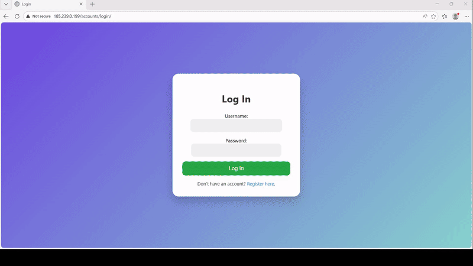

# Todo App - Django CBV

A production-oriented Todo application built with **Django** and **Django REST Framework**, with a focus on clean architecture, Class-Based Views, authentication, background task processing, caching, testing, containerization, and deployment.

## 🎥 Demo



The demo provides a quick overview of the application's main functionality and user workflow.

---

## 📌 Overview

This project started as a Django-based Todo application and was developed with a focus on applying real-world backend development practices rather than building only a basic CRUD application.

The project includes:

* User authentication and authorization
* Todo/task management
* RESTful API
* Class-Based Views
* JWT authentication
* Filtering
* API documentation
* Background task processing
* Redis caching
* PostgreSQL support
* Email functionality
* Automated testing
* Code formatting and linting
* Dockerized development and deployment
* Nginx and Gunicorn for production
* Separate Docker Compose configurations for different environments

---

## ✨ Features

### 👤 Authentication & Authorization

* User registration and authentication
* Token-based authentication using **JWT**
* Access and refresh token support
* Protected API endpoints
* User-specific data access
* Permission-based access control

JWT authentication is implemented using `djangorestframework-simplejwt`.

---

### 📝 Todo Management

Users can manage their own tasks through the application.

Core functionality includes:

* Create a todo
* View todos
* Update todos
* Delete todos
* Mark todos as completed
* Manage user-specific tasks

The application follows Django's **Class-Based View** approach for handling application logic.

---

### 🔌 REST API

The project provides a RESTful API using **Django REST Framework**.

The API layer is designed around standard REST principles and supports:

* JSON-based requests and responses
* Authentication
* Serialization
* Validation
* Filtering
* Permission handling
* API documentation

---

### 🔎 Filtering

The API includes filtering functionality using:

* `django-filter`

This allows API consumers to retrieve more specific subsets of data instead of requesting the entire dataset.

---

### 📚 API Documentation

Interactive API documentation is provided using:

* **Swagger / OpenAPI**
* `drf-yasg`

This makes it easier to explore available endpoints, understand request/response structures, and test the API without manually constructing every request.

---

### ⚡ Background Tasks

The project uses **Celery** for asynchronous and scheduled background processing.

Components include:

* Celery Worker
* Celery Beat
* Redis as the message broker

This allows time-consuming or scheduled operations to be moved away from the main request/response cycle.

---

### 🚀 Redis & Caching

**Redis** is integrated into the application for caching and Celery message brokering.

The project uses:

* `redis`
* `django-redis`
* Celery + Redis

This architecture allows frequently accessed data and background-job communication to be handled efficiently.

---

### 📧 Email System

Email functionality is integrated using:

* `django-mail-templated`

The project also includes **smtp4dev** in the Docker development environment, allowing emails to be tested locally without sending real emails.

The development Docker Compose configuration exposes smtp4dev's web interface for inspecting generated emails.

---

### 🗄️ PostgreSQL

The project supports **PostgreSQL** as the production database.

The staging Docker environment includes a PostgreSQL 15 container with persistent storage.

This makes the application architecture closer to a real-world deployment environment rather than relying exclusively on SQLite.

---

### 🐳 Docker

The application is fully containerized.

The repository includes:

* `Dockerfile`
* `docker-compose.yml`
* `docker-compose-stage.yml`
* `docker-compose-prod.yml`

The Docker image is based on **Python 3.12**.

The development Compose setup includes separate containers for:

* Django backend
* Redis
* Celery worker
* Celery Beat
* smtp4dev

The staging setup additionally includes:

* PostgreSQL
* Nginx
* Gunicorn

---

### 🌐 Nginx & Gunicorn

The staging environment uses:

**Gunicorn**

as the WSGI application server and

**Nginx**

as the reverse proxy and static/media server.

The architecture is therefore:

```text
Client
  │
  ▼
Nginx
  │
  ▼
Gunicorn
  │
  ▼
Django
  │
  ├── PostgreSQL
  ├── Redis
  └── Celery
```

---

### 🧪 Testing

The project includes a testing setup based on:

* `pytest`
* `pytest-django`
* `faker`

This allows application behavior to be tested independently from the development server.

---

### 🧹 Code Quality

Development tooling includes:

* **Black** for code formatting
* **Flake8** for linting
* **pytest** for automated testing

These tools help maintain consistent code style and catch common issues during development.

---

### 🔐 CORS

Cross-Origin Resource Sharing is supported through:

* `django-cors-headers`

This allows the backend to be configured for communication with external frontend applications or clients hosted on different origins.

---

## 🛠️ Tech Stack

| Technology            | Purpose                       |
| --------------------- | ----------------------------- |
| Python                | Programming language          |
| Django 5.1.6          | Web framework                 |
| Django REST Framework | REST API                      |
| Simple JWT            | JWT authentication            |
| PostgreSQL            | Production database           |
| Redis                 | Cache & message broker        |
| Celery                | Background & scheduled tasks  |
| Docker                | Containerization              |
| Docker Compose        | Multi-container orchestration |
| Nginx                 | Reverse proxy                 |
| Gunicorn              | WSGI server                   |
| django-filter         | API filtering                 |
| drf-yasg              | Swagger/OpenAPI documentation |
| django-cors-headers   | CORS support                  |
| django-mail-templated | Email templating              |
| pytest                | Testing                       |
| pytest-django         | Django testing integration    |
| Faker                 | Test data generation          |
| Black                 | Code formatting               |
| Flake8                | Linting                       |

---

## 🏗️ Architecture

The project is structured around Django's application architecture and separates responsibilities between the web application, database, cache, and background processing systems.

### Development Environment

```text
                    ┌──────────────┐
                    │    Client    │
                    └──────┬───────┘
                           │
                           ▼
                    ┌──────────────┐
                    │    Django    │
                    │   Backend    │
                    └──────┬───────┘
                           │
              ┌────────────┼────────────┐
              │            │            │
              ▼            ▼            ▼
          ┌───────┐    ┌───────┐   ┌──────────┐
          │ Redis │    │Celery │   │ smtp4dev │
          └───────┘    └───────┘   └──────────┘
```

### Staging / Production-Oriented Environment

```text
                  ┌──────────────┐
                  │    Client    │
                  └──────┬───────┘
                         │
                         ▼
                  ┌──────────────┐
                  │    Nginx     │
                  └──────┬───────┘
                         │
                         ▼
                  ┌──────────────┐
                  │   Gunicorn   │
                  └──────┬───────┘
                         │
                         ▼
                  ┌──────────────┐
                  │    Django    │
                  └──────┬───────┘
                         │
             ┌───────────┼───────────┐
             │           │           │
             ▼           ▼           ▼
       ┌──────────┐  ┌───────┐  ┌─────────┐
       │PostgreSQL│  │ Redis │  │ Celery  │
       └──────────┘  └───────┘  └─────────┘
```

---

## 📁 Repository Structure

```text
Todo-app-CBV/
│
├── core/
│   └── Django application
│
├── .github/
│   └── GitHub Actions workflows
│
├── Dockerfile
├── docker-compose.yml
├── docker-compose-stage.yml
├── docker-compose-prod.yml
├── default.conf
├── requirements.txt
├── .gitignore
├── .gitattributes
└── LICENSE
```

---

## 🚀 Getting Started

### Prerequisites

Make sure the following are installed:

* Python 3.12+
* Git
* Docker
* Docker Compose

---

## 🔧 Local Development

### 1. Clone the repository

```bash
git clone https://github.com/SAEED-ESK/Todo-app-CBV.git
cd Todo-app-CBV
```

### 2. Create a virtual environment

```bash
python -m venv venv
```

Activate it on Windows:

```bash
venv\Scripts\activate
```

On Linux/macOS:

```bash
source venv/bin/activate
```

### 3. Install dependencies

```bash
pip install -r requirements.txt
```

### 4. Configure environment variables

Create a `.env` file and provide the required Django configuration.

Example:

```env
SECRET_KEY=your-secret-key
DEBUG=True
```

For production, use a strong secret key and keep sensitive credentials outside the repository.

---

## 🐳 Running with Docker

The repository includes a Docker Compose configuration for local development.

Run:

```bash
docker compose up --build
```

The development environment starts the required services including:

* Django backend
* Redis
* Celery worker
* Celery Beat
* smtp4dev

The Django application is exposed on:

```text
http://localhost:8000
```

smtp4dev is available through:

```text
http://localhost:5000
```

---

## 🏭 Staging Environment

A separate staging configuration is provided:

```bash
docker compose -f docker-compose-stage.yml up --build
```

The staging environment includes:

* PostgreSQL
* Redis
* Django
* Gunicorn
* Nginx
* Celery Worker
* Celery Beat

This setup more closely resembles a production deployment architecture.

---

## 🧪 Running Tests

Run the test suite with:

```bash
pytest
```

For more detailed output:

```bash
pytest -v
```

---

## 🧹 Code Formatting & Linting

Format the code with Black:

```bash
black .
```

Run Flake8:

```bash
flake8 .
```

---

## 📖 API Documentation

After starting the application, the API documentation can be accessed through the Swagger/OpenAPI interface configured with `drf-yasg`.

The documentation provides an interactive way to inspect and test available API endpoints.

---

## 🔑 Authentication

The API uses **JWT-based authentication**.

The authentication flow is based on access and refresh tokens.

A typical authenticated request uses:

```http
Authorization: Bearer <access_token>
```

The refresh token can be used to obtain a new access token when the current access token expires.

---

## ⚙️ Environment Configuration

The application is designed to keep environment-specific configuration outside the source code.

Typical configuration areas include:

* Django secret key
* Debug mode
* Database configuration
* Redis configuration
* Email configuration
* Allowed hosts
* CORS configuration
* JWT configuration

For production deployments, credentials and secrets should be supplied through environment variables or a secure secret-management system.

---

## 📦 Deployment

The project includes the components required for a containerized deployment:

```text
Docker
   │
   ├── Django
   ├── Gunicorn
   ├── Nginx
   ├── PostgreSQL
   ├── Redis
   ├── Celery Worker
   └── Celery Beat
```

Static and media files are handled through Docker volumes in the staging configuration.

---

## 🎯 Project Goals

The main goal of this project was not simply to create another Todo application.

It was built as a practical backend project to demonstrate experience with:

* Django backend development
* Class-Based Views
* REST API design
* Authentication and authorization
* Database integration
* Asynchronous processing
* Caching
* Automated testing
* Containerization
* Production-oriented deployment
* Code quality tooling

---

## 📈 What I Practiced

Through this project, I worked with several concepts commonly used in real-world Django backend projects:

* Building APIs with Django REST Framework
* Structuring Django applications
* Implementing authentication with JWT
* Handling permissions and user-specific resources
* Filtering API results
* Generating API documentation
* Running asynchronous tasks with Celery
* Using Redis for caching and task brokering
* Working with PostgreSQL
* Containerizing applications with Docker
* Running Django through Gunicorn
* Configuring Nginx
* Writing automated tests
* Maintaining code quality with Black and Flake8

---

## 📄 License

This project is licensed under the **MIT License**.

See the [LICENSE](LICENSE) file for more information.

---

## 👨‍💻 Author

**Saeed Eskandary**

* GitHub: [@SAEED-ESK](https://github.com/SAEED-ESK)
* Repository: [Todo-app-CBV](https://github.com/SAEED-ESK/Todo-app-CBV)

---

## ⭐ If you found this project useful

Feel free to explore the repository, review the implementation, or use it as a reference for building Django applications with a more production-oriented architecture.
